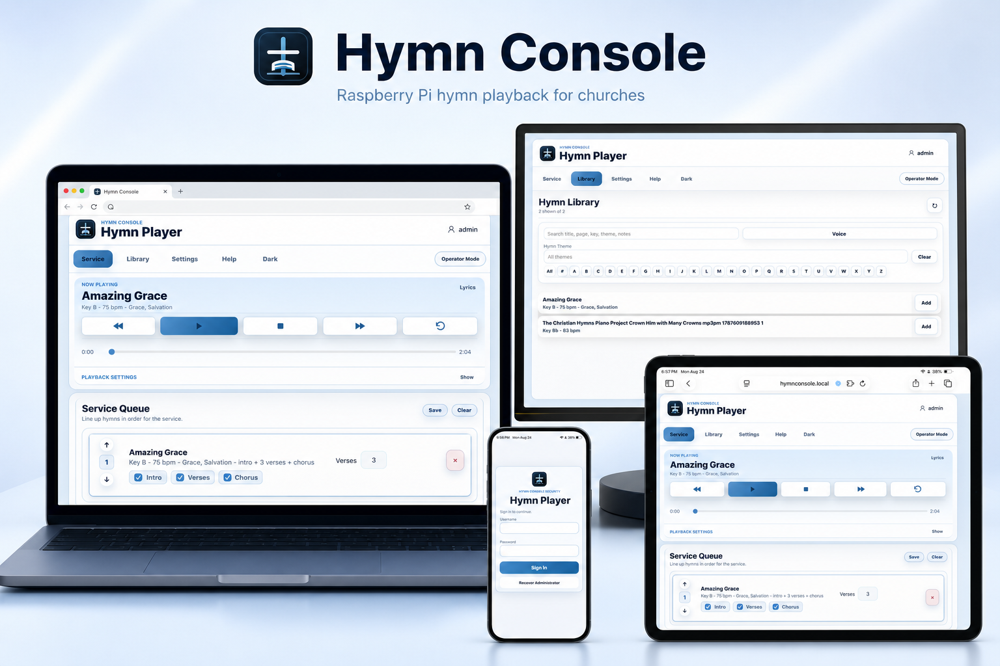

# Hymn Console

[](https://github.com/Jonsueppel/Hymn-Console/actions/workflows/ci.yml)


Hymn Console is a Raspberry Pi powered hymn playback system for churches that need reliable service music without a pianist. It stores MP3 hymns locally, lets volunteers build a service queue from phones, tablets, and laptops, and plays audio through either the current browser device or the Raspberry Pi connected to the church sound system.

The goal is simple: upload hymns, organize a service, press play, and keep worship moving without a complicated audio workstation.

> Built for local church networks, volunteer operators, and reliable Sunday service playback.

## Highlights

- Mobile-friendly hymn player for iPhone, iPad, Android, Windows, and macOS browsers.
- Local MP3 library stored on the Raspberry Pi SD card or a USB drive.
- Searchable hymn library with alphabet navigation, hymn theme search, CSV import/export, and bulk MP3 upload.
- Service queue with verse count, Intro, Verses, Chorus options, saved service plans, queue lock, and operator mode.
- Sound System playback from the Raspberry Pi using `mpv` and `ffmpeg`.
- This Device playback for phone, tablet, or laptop speakers.
- AirPlay receiver support through Shairport Sync.
- Lyrics viewer, editable hymn metadata, audio defaults, fades, and Smart Build timing.
- Administrator and operator accounts with granular permissions.
- SQLite storage, streamed uploads, trash recovery, complete backups, diagnostics, and self-test tools.

## Who It Is For

Hymn Console is designed for churches that:

- Do not always have a pianist or accompanist available.
- Have MP3 hymn recordings they want to play from a reliable local device.
- Need a simple service queue that volunteers can operate from a phone, tablet, or laptop.
- Want the Raspberry Pi connected directly to the church sound system.
- Prefer local control instead of depending on cloud playback during worship.

## How It Works

```text
Phone / Tablet / Laptop
  Browser control at http://hymnconsole.local:8080
              |
              v
Church Wi-Fi / Ethernet network
              |
              v
Raspberry Pi running Hymn Console
  - Node.js web app on port 8080
  - SQLite data, users, plans, settings
  - MP3 storage on SD card or USB drive
  - Shairport Sync AirPlay receiver
              |
              v
Raspberry Pi audio output
  USB audio / HDMI / headphone output
              |
              v
Church mixer, amplifier, or powered speakers
```

## Core Workflow

1. Upload MP3 hymns to the Raspberry Pi SD card or USB storage.
2. Edit hymn details such as title, page, key, tempo, themes, lyrics, and playback defaults.
3. Add hymns to the Service Queue.
4. Choose verse count and Intro, Verses, Chorus options.
5. Select **This Device** or **Sound System** output.
6. Press Play and run the service.
7. Save the queue as a reusable service plan.
8. Download or save complete backups.

## Screenshots



Additional public-safe screenshots can be placed in `docs/screenshots/`.

Recommended captures:

- Service page desktop
- Service page phone
- Library page
- Settings page
- Login screen
- Operator mode

## Raspberry Pi Quick Install

On the Raspberry Pi:

```bash
cd /opt
sudo git clone https://github.com/Jonsueppel/Hymn-Console.git hymn-console
sudo chown -R pi:pi /opt/hymn-console
cd /opt/hymn-console
npm install --omit=dev
sudo RUN_USER=pi bash deployment/install-rpi.sh
```

Open from another device on the same network:

```text
http://hymnconsole.local:8080/
```

Or use the Pi IP address:

```text
http://<raspberry-pi-ip-address>:8080/
```

More detail: `docs/INSTALL.md` and `deployment/README.md`.

## First-Time Login

On first launch, Hymn Console walks you through creating the built-in administrator account. After setup:

- Create operator accounts for volunteers.
- Grant only the permissions each person needs.
- Keep the administrator recovery code off the Raspberry Pi.
- Store OpenAI/API secrets only in app settings or server environment files, never in Git.

## Updating From GitHub

On the Pi:

```bash
cd /opt/hymn-console
git pull --ff-only
sudo RUN_USER=pi bash deployment/install-rpi.sh
sudo systemctl restart hymn-console
```

Verify:

```bash
curl http://localhost:8080/api/health
```

## Local Development

```powershell
npm install
npm run check
npm test
node server.js
```

Open:

```text
http://localhost:8080/
```

## Storage

Default runtime paths:

- MP3 files: `media/`
- SQLite database: `data/hymn-console.sqlite`
- Complete backup snapshots: `data/backups/`

These folders are intentionally ignored by Git. Do not commit live church data.

## Backup Behavior

Hymn Console has two complete backup actions:

- **Download Backup to This Device** downloads a `.tar.gz` backup through the browser to the laptop, phone, or tablet currently using the app.
- **Save Backup to Pi/USB** creates a backup on the Raspberry Pi or configured off-device path.

Complete backups include the SQLite database, users, settings, service queue, service plans, themes, custom logo, and MP3 files.

## Security And Privacy

Never commit:

- Church MP3 files
- SQLite databases
- Backups
- OpenAI API keys
- Recovery codes
- `.env` files
- Private certificates or keys

Hymn Console is designed for a private church-device network. Do not expose the Raspberry Pi directly to the public internet.

See `SECURITY.md` for reporting and deployment guidance.

## Documentation

- `docs/README.md` - documentation index.
- `docs/INSTALL.md` - installation and update instructions.
- `docs/USER-GUIDE.md` - operator and administrator user guide.
- `docs/PRODUCTION-VALIDATION.md` - real-device validation checklist.
- `docs/RELEASE-CHECKLIST.md` - release and deployment checklist.
- `deployment/README.md` - Raspberry Pi installer details.
- `CHANGELOG.md` - release history.
- `CONTRIBUTING.md` - contribution and local development guidance.
- `SUPPORT.md` - support boundaries and troubleshooting paths.

## Validation

Before worship use on new hardware:

```bash
npm run check
npm test
sudo hymn-console-self-test
```

Then complete the checklist in `docs/PRODUCTION-VALIDATION.md`.

## License

This repository is source-available. All rights are reserved unless a separate written license is provided. See `LICENSE`.
